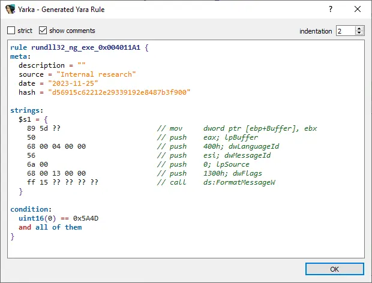

## Yarka - create YARA signatures from selection

IDA plugin with no dependencies to easily create YARA signatures 
by selecting a set of instructions, strings or binary data. 
Just select chunk and press `Ctrl+Y` to make the rule



### Features
- Make rule from any entities in selection in "**Disassembly**" and "**Decompile**" views
- Make rule from selection in "**Strings**" view
- Make "hunting" ruleset from selection in "**Functions**" view, 
  rule contains basic blocks and data refs content (strings, constants, etc...)
- Yara syntax highlighting
- Easy customization (see "[Customization](#customization)" section)

### Installation
Copy `yarka.py` and `yarka` to your IDA plugins directory (`%IDA_HOME%/plugins`).

### Customization
You can customize the rules format to suit your needs.
To do this, replace global parameters in header of `yarka.py` file

Rule style parameters:
- `WRAP_CURLY_BRACE` - wrap curly brace on a new line (default: `False`)
- `INDENT_HEADERS` - indent `meta`, `strings`, `condition` (default: `False`)

Rule editor default parameters (also editable in the editor window):
- `DEFAULT_SHOW_COMMENTS` - show comments (default: `True`) 
- `DEFAULT_STRICT_RULE` - don't wildcard relative offsets (default: `False`)
- `DEFAULT_INDENT` - rule indentation (default: `2`)

Default fields in `meta` section. Values can be string or lambda functions
```python
DEFAULT_META_FIELDS = {
    'company': 'Security Inc.',
    'date': lambda: str(date.today()),
}
```

Default fields in `conditions` section. 
Values can be string or lambda functions (with optional argument - strings count): 
```python
DEFAULT_CONDITIONS = [
    lambda: '(PE)' in idaapi.get_file_type_name() and 'uint16(0) == 0x5A4D',
    lambda count: f'{2 * count // 3} of them' if count > 2 else 'all of them'
]
```

### TODO
- More entities for hunting ruleset (available now via hotkey `Ctrl+Alt+Y`)
- Identify more bugs during use (waiting for your issues!)

### Credits
Thanks to [mkYARA](https://github.com/fox-it/mkYARA) IDA plugin, 
which was the inspiration for this project
